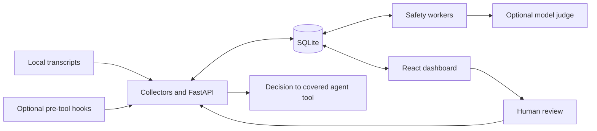

# Relay

**Understand what your coding agents did—and inspect decisions about what they should do next.** Relay brings Codex Desktop, Codex CLI, and Claude Code into one local dashboard, with searchable conversations, policy-based tool review, and incident investigations backed by conversation evidence.


## Choose your path

| I want to… | Start here |
| --- | --- |
| See the product without installing it | [Screenshots and guided tour](docs/demo.md#the-three-minute-tour) |
| Explore a populated dashboard, without an agent or API key | [Run the sample demo](#run-the-sample-demo) |
| Monitor my own coding agent | [Local setup and agent connections](docs/setup.md) |
| Understand the engineering | [Architecture and trade-offs](docs/architecture.md) · [Tests](docs/testing.md) · [Relay Lab](lab/README.md) |

## Run the sample demo

On **Windows with PowerShell**, install [uv](https://docs.astral.sh/uv/) and [Node.js](https://nodejs.org/) **22.12+ with npm 10+**. Clone or download this repository, open PowerShell in its folder, and run:

```powershell
powershell -ExecutionPolicy Bypass -File scripts/demo.ps1
```

The launcher installs locked dependencies (including Python 3.11 through uv if needed), builds the dashboard, and opens **http://127.0.0.1:8001**. The first run needs internet access. A spotlight tour guides you through the actual app: click a session, inspect its conversation, investigate a denied upload, trace a human review, and visit Connections. Finish or exit the tour to explore freely; restart and reset controls remain available.

**No agent, account, or API key is required.** All stories, assessments, token counts, and execution records are synthetic. Scenario commands are never executed. Demo mode does not discover personal transcripts, change agent hooks, or make model calls, even if credentials are configured. You can dismiss sample incidents; **Reset demo** restores the starting state. Ctrl+C stops the server. Restarting also resets the demo.

Sample data stays in `data/demo/monitor.db`, separate from normal monitoring. See [demo options and troubleshooting](docs/demo.md#launch-options).

## What to explore

- **Overview and Explorer:** compare activity across providers and read conversations alongside tool requests and results.
- **Safety:** distinguish the assessment, the decision delivered to the agent, and recorded execution. Permission does not establish success.
- **Incidents:** follow concerns back to user intent and action evidence; dismiss an incident while retaining its evidence.
- **Policies and Lab:** inspect the rule workflow and test synthetic scenarios through an isolated pipeline. The main demo keeps configuration changes disabled; [Lab](lab/README.md) supports scripted experiments without executing commands.

## How it fits together



SQLite and a local API keep installation small. Durable evaluation jobs separate model latency from API requests. Transcript checkpoints support recovery, while hooks provide pre-execution decisions for covered tools. Read [the architecture](docs/architecture.md) for the boundaries and trade-offs.

## Use it with your own agent

Follow [setup](docs/setup.md): install → import transcripts → optionally enable hooks and live safety review. Transcript browsing needs no API key. Live evaluation uses paid model API calls and sends selected action and conversation context to the configured judge provider. Anthropic is the default and recommended provider. Optional [OpenAI support](docs/setup.md#optional-openai-credentials-untested) is available for judgments and incident analysis, but has not been tested with live API calls. Hook setup backs up the affected configuration; **Disable live hooks** removes Relay's handlers. See [hook setup and removal](docs/setup.md#optional-live-hooks-and-blocking).

Relay is a local prototype, currently documented for Windows. Conversation data is stored in plaintext. Hook coverage is limited, model judgments can be wrong, and SQLite contention can affect review deadlines. Keep the application on your own machine. The synthetic demo illustrates behavior; it is not a measurement of live detection accuracy.

## Development and release status

[Testing commands and CI](docs/testing.md) cover Python, the production frontend build, and browser workflows. [Policies](docs/policies.md), [human review](docs/human-review.md), and the [usage reference](docs/usage-reference.md) explain the detailed behavior.

Release preparation is in progress. A recorded walkthrough, clean-machine installation verification, privacy/history audit, license selection, and tagged release remain on the [release checklist](docs/release-checklist.md).
