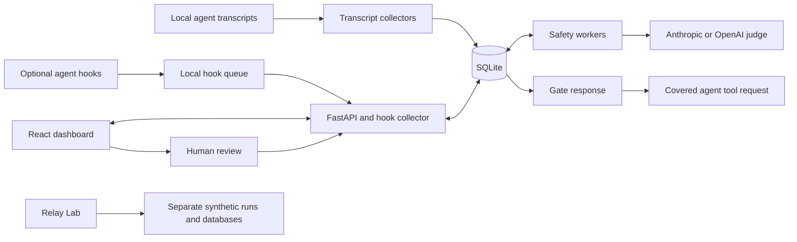

# Architecture and engineering tradeoffs

> Anthropic is the default and recommended judge provider. OpenAI is also available for judgments and incident analysis, but has not been tested with live API calls. See [OpenAI setup](setup.md#optional-openai-credentials-untested). Anthropic-specific details below describe the default configuration.

Relay separates recorded activity, decisions about proposed actions, and evidence of execution. A transcript tool call is an observation; an allow verdict is permission; a completion record is separate evidence. The UI preserves these distinctions rather than inferring success from a request.

## System overview

## Components and data flow

| Component | Main modules | Responsibility |
| --- | --- | --- |
| Transcript ingestion | `backend/connectors.py`, `backend/claude_code.py`, `backend/providers.py` | Normalize supported local records and maintain replay checkpoints |
| Storage and queries | `backend/db.py`, `backend/analytics.py`, `backend/token_usage.py` | Persist events and provider payloads; apply shared search, scope, and aggregation |
| Local API | `backend/main.py` | Serve the built UI, API, transcript collector, and hook collector |
| Hooks and gate | `backend/hooks.py`, `backend/blocking.py`, `scripts/gate_hook.py` | Capture live requests, correlate observations, wait for covered decisions, and record receipts |
| Policies and evaluation | `backend/policies.py`, `backend/safety.py`, `backend/safety_worker.py`, `backend/judge.py` | Match policy, persist work, evaluate requests, and enforce budgets |
| Investigations | `backend/incidents.py`, `backend/incident_analysis.py` | Group concerns and maintain evidence, notes, resolution, and retrospective analysis |
| Dashboard | `frontend/src/` | Explore activity, manage policy drafts, review pending requests, and inspect incidents |
| Lab | `lab/server.py`, `lab/runner.py`, `lab/worker.py` | Run synthetic scenarios through isolated copies of the pipeline |

### Observing activity

The API process polls configured transcript sources. Provider adapters map records into sessions, events, and reported token usage. Checkpoints and imported records are committed together; replay handles truncation and rewrites without duplicating unchanged observations. Session identity includes its connection, so multiple profiles remain distinct.

The browser queries the API for filtered activity. Charts show recorded timestamps and provider-reported usage, not reconstructed execution timing or estimated billing. Optional hook observations can arrive before transcript records; exact tool-call correlation avoids counting the same action twice when matching records arrive.

### Reviewing a covered action

A configured pre-tool hook submits a local request. Deterministic prohibitions and applied policies can resolve or route it; model-dependent work is persisted for safety workers. A judge recommendation may allow, deny, or request human review. Decisions retain their assessed inputs and deadlines, so late or stale results cannot authorize a different request.

Blocking requests have a fixed 60-second deadline. Automated evaluation reserves time for human response and delivery. Worker lanes reserve capacity for blocking calls; incident analysis has an independent lane. An allow response still passes through the agent's native permission system. Retrospective incident resolution never approves an action.

### Testing the pipeline

Relay Lab creates a migrated database, transcript fixtures, and local queues for each run. It uses the production collection and decision machinery, with either a scripted evaluator or live requests to the configured judge provider. The described tools are never executed. Reports distinguish expected assessments, receipt delivery, faults, and model disagreements.

## Why these choices?

- **React and TypeScript:** interactive filtering, linked views, and review state without a server-rendering requirement. TanStack Query manages server state; Recharts supplies chart primitives.
- **FastAPI and Pydantic:** typed request validation and generated API documentation, with Python adapters and evaluation utilities in the same codebase.
- **SQLite WAL and SQLAlchemy:** low-friction local installation and durable relational state. Alembic makes schema changes explicit. WAL does not remove SQLite's single-writer limit.
- **Separate safety worker process:** model work does not occupy API request handlers. Persisted jobs survive interruptions; claims, retries, and deadlines remain inspectable.
- **Local hooks plus transcripts:** hooks provide a pre-execution decision point for covered tools, while transcripts provide history and recovery. Neither source provides universal visibility.
- **Isolated Lab:** synthetic evidence without importing real conversations or executing scenario commands.

## Deliberate limits

This is one local application instance with one API worker. Synchronization and admission controls are partly process-local. High contention can produce missed deadlines even when records eventually reconcile. A same-account process can tamper with local files; the policy store is not an independent security boundary.

Shell matching cannot interpret all scripts or encoded commands. Model evaluation can miss harmful effects or over-escalate harmless work. Redaction is limited, and filesystem checks cannot eliminate changes between assessment and execution.

Multiple hosts or authenticated operators would need stronger executor isolation, protected policy storage, authentication, and distributed queue/quota control. PostgreSQL and a transactional outbox are potential future choices, not current capabilities.

## Further evidence

- [Transcript recovery](transcript-recovery.md)
- [Blocking safety](rfc-005-blocking-safety.md)
- [Performance and deadlines](rfc-006-safety-performance.md)
- [Policies and boundaries](policies.md)
- [Lab validation, including failures](../lab/VALIDATION.md)
