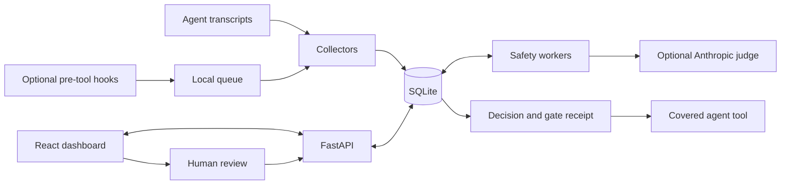

# Architecture

Relay is a local React/TypeScript dashboard backed by FastAPI and SQLite. It keeps three facts separate: a recorded tool request, permission to proceed, and evidence of execution.

## Components

| Area | Modules | Responsibility |
| --- | --- | --- |
| Ingestion | `backend/connectors.py`, `claude_code.py`, `providers.py` | Normalize transcripts and maintain replay checkpoints |
| Storage/querying | `backend/db.py`, `analytics.py`, `token_usage.py` | Persist events and provider records; filter and aggregate |
| API | `backend/main.py` | Serve the UI/API and run collectors |
| Gate | `backend/hooks.py`, `blocking.py`, `scripts/gate_hook.py` | Capture requests, deliver bound decisions, and record receipts |
| Evaluation | `backend/policy_actions.py`, `policies.py`, `safety.py`, `safety_worker.py`, `judge.py` | Match rules, manage durable jobs, and evaluate within deadlines |
| Incidents | `backend/incidents.py`, `incident_analysis.py` | Group concerns and analyze cited evidence |
| UI | `frontend/src/` | Browse activity, edit rules, and review requests |
| Lab | `lab/server.py`, `runner.py`, `worker.py` | Exercise the pipeline with isolated synthetic runs |

## Data flow

Collectors poll configured sources and commit normalized records with their checkpoints. Replay recovers from truncation and rewrites without duplicating unchanged observations. Session identity includes its connection. Exact tool-call IDs correlate hook observations with transcripts; no time/argument guessing merges unrelated calls. See [transcript recovery](transcript-recovery.md).

A pre-tool hook captures a proposed action. Built-in prohibitions and applied policies resolve or route it; model-dependent work becomes a durable job. Workers evaluate outside database transactions. Results remain bound to their action, inputs, and deadline, so stale results cannot release another request.

Blocking has a fixed 60-second deadline with time reserved for human review and delivery. Worker lanes reserve blocking capacity; incident analysis has an independent lane. Native agent permissions still apply after release. [Usage](usage-reference.md#debug-and-performance) documents the current budgets; [policies](policies.md) explains deterministic routing.

## Demo and Lab

The main demo selects `data/demo/monitor.db` before database initialization and ignores `DATABASE_URL`. It seeds fictional sessions and decisions, disables collectors, credential reads, workers, and live configuration changes, and permits reset and incident edits. It demonstrates the UI.

Lab creates a new migrated database, queues, and transcripts for each run. It exercises production collection and decision code using simulated or live judge responses. It never executes scenario commands. See [Lab](../lab/README.md).

## Trade-offs

- **SQLite WAL** keeps installation small and state durable, but still allows only one writer. Contention can cause missed deadlines.
- **Separate workers** keep model latency out of API handlers. Durable jobs recover after interruption; retries can incur duplicate API charges after a crash.
- **Hooks plus transcripts** provide covered pre-execution checks and recoverable history. Neither provides universal visibility.
- **One local API worker** is required because some locks and admission controls are process-local.

Model judgments and shell matching can miss harmful effects. Data is local plaintext with limited redaction for model calls. Same-account processes can modify local policy and queues; filesystem checks cannot eliminate changes between assessment and execution.

Multi-host or authenticated operation would require protected storage, stronger executor isolation, authentication, and distributed capacity controls. PostgreSQL and an outbox are future options. [Design records](README.md#design-and-development-records) explain earlier milestones.
