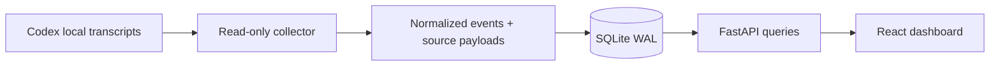

# Ingestion and enforcement design

Research date: 15 September 2026. This document separates verified integration behavior from the proposed next phase. No hooks, security workers, or blocking controls are installed by v0.1.

## Integration findings

| Source | Observation path | Possible control path | v0.1 decision |
| --- | --- | --- | --- |
| Codex Desktop | Local JSONL transcripts | Current Codex hooks describe pre-tool decisions, subject to runtime support and tool coverage | Read-only transcript polling; do not change the running agent |
| Claude Code, later | Lifecycle hooks and transcripts; telemetry | Synchronous pre-tool hooks for supported calls | Design now, implement and qualify later |
| Agent runtime we own, later | Emit events directly around each operation | Tool executor or broker enforces decisions | Strongest candidate for controlled stress tests |


Codex documents local and archived session transcript locations. We verified the installed Desktop identifies itself with `originator: "Codex Desktop"`; `source: "vscode"` alone cannot distinguish the desktop from an IDE extension. The adapter requires Desktop provenance. [Codex troubleshooting](https://learn.chatgpt.com/docs/reference/troubleshooting)

### Hook semantics that matter

Claude Code: `PreToolUse` can reject before execution; `PostToolUse` cannot undo execution. Async hooks cannot control the action. HTTP hook connection failures, non-2xx responses, and invalid decision bodies are non-blocking errors. A successful HTTP response must carry the correct denial fields to reject a call. [Claude hooks reference](https://code.claude.com/docs/en/hooks)

Codex: pre-tool hooks cover many local tools but omit some paths, including hosted tools. `write_stdin` does not repeat the pre-tool check. Hook definitions require trust; transcript format is not stable. A successful pre-tool rejection can use a structured deny decision or exit code 2. This is useful control over covered calls, not complete isolation. Installed-version support still needs a separate compatibility test. [Codex hooks](https://learn.chatgpt.com/docs/hooks)

Codex app-server exposes stored thread reads and approval requests associated with thread, turn, and item IDs. Approval handling belongs to the client controlling that app-server connection. Starting another server does not establish interception of the already-running Desktop's requests; approval events also depend on permission configuration. [Codex app-server](https://learn.chatgpt.com/docs/app-server)

MCP defines calls to tools exposed by a server. Therefore a proxy can observe/control traffic routed through it, not every host action, built-in tool, or conversation. Tool annotations are not a trustworthy security policy. [MCP tools specification](https://modelcontextprotocol.io/specification/2025-06-18/server/tools)

Claude Code offers OpenTelemetry metrics/events for usage and operations. Treat telemetry as an observation feed; it is not a synchronous permission protocol. [Claude monitoring](https://code.claude.com/docs/en/monitoring-usage)

## Current pipeline



Connections identify a configured source; sessions identify provider conversations. Each session belongs to one connection. Events have a source identity unique inside a session, an ingestion time, an occurrence time, a schema version, nullable turn/tool-call correlation, and the original relevant record. Unknown provider events are not fabricated into messages. Source transcripts remain available for a future adapter upgrade.

The Codex collector commits events and its byte checkpoint in the same transaction. It reads complete lines only; a partial final line waits for the next poll. A changed header or truncated file is reported rather than silently reusing offsets. Repeated scans and process restarts do not duplicate events. A malformed record rolls back the connection's batch and exposes an error. Processing is capped at 5,000 records per file per cycle, although total work across many files is not globally bounded. Directory rescanning is a v0.1 scalability limit.

Collector interval is 3 seconds; UI query refresh is 4 seconds. This is near-real-time observation of flushed records, not a latency guarantee. Initial backfill, file count, large batches, or delayed source writes can add lag. Only `response_item` messages/tool calls/results are normalized, avoiding duplicate `event_msg` mirrors. Other records, cloud-only chats, images, and hidden reasoning are not represented. Tool-call counts indicate recorded requests, not successful execution. No token, cost, or latency values are estimated.

Some Codex calls are orchestration wrappers (for example `exec`) that invoke other tools internally. The transcript adapter counts the outer recorded call; it does not infer nested actions from JavaScript or shell text. Future enforcement must instrument the actual tool/executor boundary. Optional sibling `session_index.jsonl` metadata supplies human-readable titles when available.

## Proposed worker architecture (not implemented)

### 1. Observation path

Use an adapter-specific ingress layer with one shared event envelope:

```text
schema_version, event_id, connection_id, session_id, parent_session_id?
source_event_id, source_sequence?, turn_id?, tool_call_id?
kind, phase, occurred_at, received_at, source_version, payload
```

Do not equate a persisted call with a completed operation. Explicit phases should distinguish `requested`, `decision`, `started`, `completed`, and `failed`. Keep decision metadata separate from evidence: policy version, rule/worker version, decision ID, elapsed time, outcome, reason, and input hash. Optional relationships remain unknown when the source omits them.

For dependable delivery, acknowledge after durable commit. Add an outbox in the ingestion transaction; workers claim durable work, acknowledge results, and retry with bounded backoff. Expect at-least-once delivery and make consumers idempotent. Preserve per-session ordering where available; do not promise a total order across agents. A source's replay IDs must be retained across retries, not regenerated at each HTTP attempt.

Separate fast ingestion from expensive analysis. Put explicit caps on batch bytes, queue size, retries, concurrent work, and pending decisions. Backpressure should pause/reject new work visibly rather than silently discard events. A local spool can preserve telemetry while the service is unavailable. Poison events go to an inspectable dead-letter store with replay controls.

### 2. Decision path

Keep a synchronous decision service separate from the dashboard and async analysis queue. An enforcement adapter pauses a proposed action, checks fast deterministic policy, consults a worker only when required and within a deadline, then returns an explicit decision. Broad LLM reviews should usually run asynchronously; an LLM judgment is evidence, not a guarantee.

For future hook adapters, a small local command wrapper should translate worker unavailability, timeout, malformed output, or stale policy into an explicit denial before the outer hook deadline. A direct HTTP hook is insufficient for a fail-closed requirement. This wrapper cannot cover failure to launch the hook itself, bypassed hooks, unprotected config, or uncovered tools. Stronger assurance requires an executor/broker or sandbox outside the agent's write permissions, with the agent unable to bypass that boundary.

Policy must operate on resolved paths and actual execution scope, not just suspicious words. Consider symlinks, path traversal, shell composition, persistent shells, subprocesses, network access, and time-of-check/time-of-use races. A generic shell permission can authorize many later effects; individual tool hooks cannot necessarily see them all. Avoid claiming that a string blacklist blocks malicious behavior.

### 3. Measurements and failure tests

Track ingestion lag (occurrence→commit), queue age/depth, processing throughput, duplicate/retry counts, dead letters, source coverage, heartbeat age, and end-to-end decision p50/p95/p99 latency. Track worker errors/timeouts and classifier false positives/negatives against a labeled evaluation set. Measure the monitor with independent health probes and externally enforced resource limits.

Test crashes before/after commit, lost acknowledgments, out-of-order delivery, event bursts, full disk, locked DB, worker death, stalled judges, malformed hook JSON, missing hook executables, disabled hooks, timeouts, and network partitions. Simulated agents should issue harmless operations inside disposable sandboxes. Establish load targets before picking brokers or partition counts.

## Storage progression

**Now:** SQLite on a local disk, WAL, one collector/writer process, indexed normalized tables, SQLAlchemy, versioned Alembic migrations. SQLite WAL permits readers alongside a writer but still has a single writer. Do not place the database on a network filesystem. [SQLite WAL](https://www.sqlite.org/wal.html)

**Multiple processes / hosts:** migrate to PostgreSQL, add durable outbox/claiming, connection authentication, per-source credentials, retention, and backups. The ORM helps schema portability but switching the URL is not a data migration; test queries, JSON storage, locking, indexes, and data transfer. PostgreSQL would require its driver and deployment configuration.

**High-volume analytics:** measure PostgreSQL first. Consider a dedicated analytical store only if retention and query load justify it. A broker such as Redis Streams or NATS JetStream is a later option for delivery, not a replacement for authoritative event storage. Export selected structured events to a SIEM through a separate consumer; redact conversation bodies by policy.
